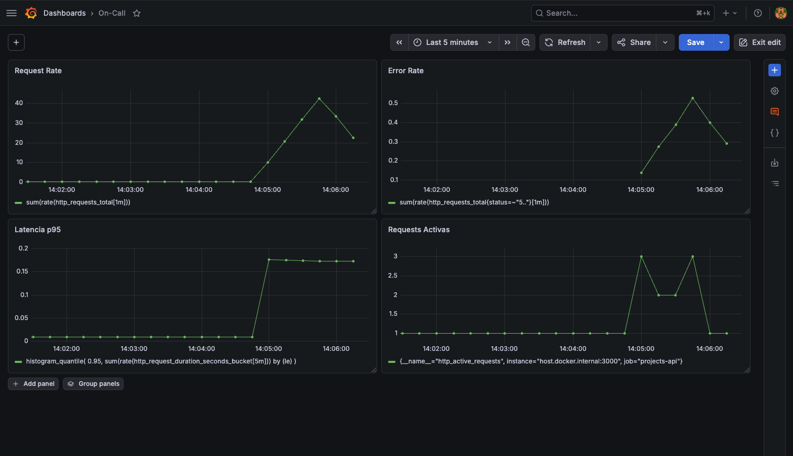
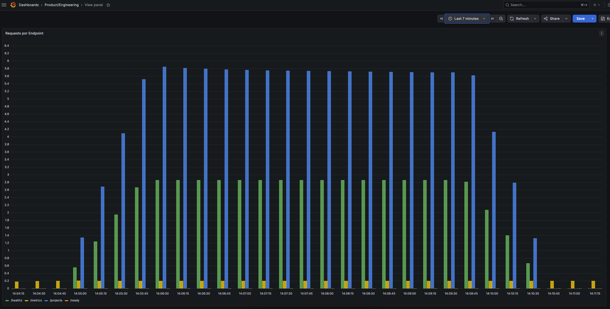

# Ejercicio C

## Punto 1 - Métrica de negocio:

Se introduce una métrica de negocio basada en la cantidad de requests por endpoint.

Esta métrica nos permite observar qué funcionalidades del sistema son más utilizadas, esto nos ayuda a entender el comportamiento del usuario dentro de la API.

Aunque en nuestro caso solo tengamos los endpoints healthz, ready y projects en un caso real se podría aplicar de forma más interesante.

## Punto 2- Stack:

Decision final - Prometheus + Grafana (Docker Compose)

Se decide usar este stack puesto que se simplifica el entorno local y puedo iterar rápido sobre métricas y dashboards sin depender del cluster. Se priorica desarrollo y claridad del setup.

## Punto 3 - Dashboards:

Se han creado dos dashboards, el primero on-call con las golden signals, en caso del dashboard de producto es donde se añade la métrica de negocio que hemos especificado antes. Las dos se han probado con el archivo de carga `load.sh`

---

## Dashboard operativo (on-call)

---

## Dashboard producto / engineering

## Punto 4 - Runbooks:

#### High Error Rate
1. Revisar logs del deployment
2. Identificar endpoint afectado
3. Verificar si hay caída de dependencias (DB / servicios externos)
4. Si es degradación parcial → rollback a última versión estable

#### High Latency
1. Verificar carga del sistema (CPU / HPA scaling)
2. Revisar endpoints más lentos en Grafana
3. Comprobar si hay saturación de recursos
4. Escalar replicas si es necesario

### High CPU Usage
1. Verificar si HPA está escalando correctamente
2. Revisar si hay picos de tráfico
3. Aumentar replicas si es necesario

## Punto Extra - SLIs y SLOs

### SLIs

1. Disponibilidad (Availability): Proporción de requests exitosas sobre el total.
2. Latencia: Tiempo de respuesta de las peticiones, SLI = porcentaje de requests con latencia < 300ms (p95)
3. Tasa de errores (Error Rate): Proporción de requests fallidas, SLI = 1 - (requests 5xx / total requests)
4. Saturación (Load / Capacity): Nivel de presión sobre el sistema, SLI = uso de CPU del contenedor + número de requests concurrentes activos

### SLOs

1. Disponibilidad: 99.5% de requests exitosas mensualmente
2. Latencia: 95% de requests con latencia < 300ms (p95)
3. Errores: < 0.5% de requests en estado 5xx
4. Saturación: CPU < 70% sostenido en el 95% del tiempo